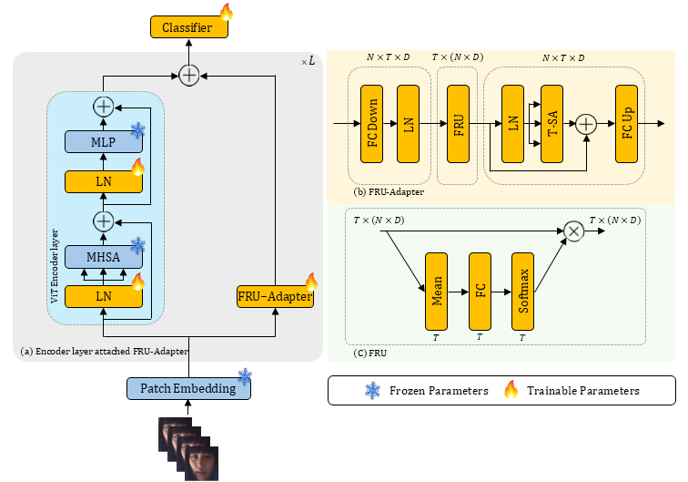
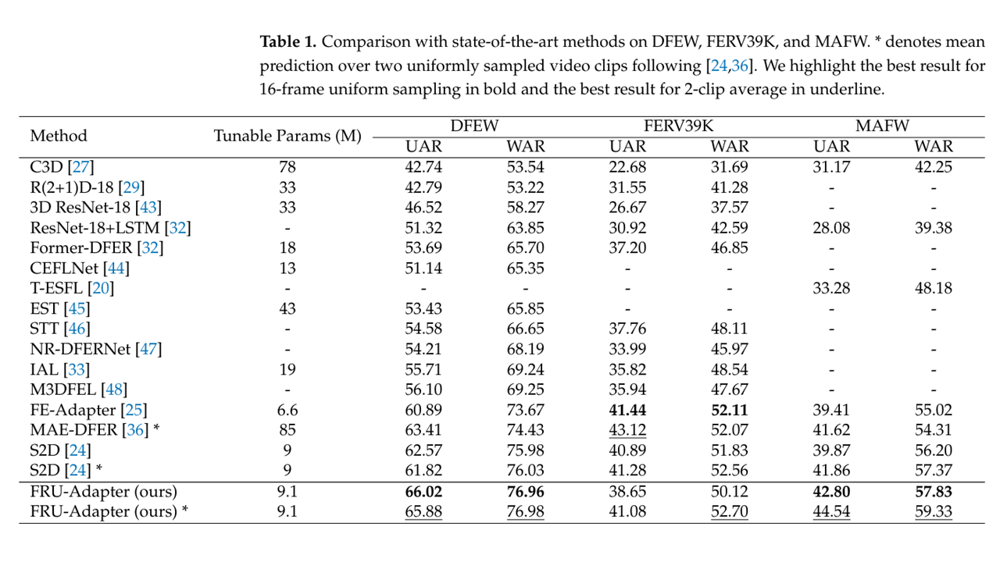

# FRU-Adapter: Frame recalibration unit adapter for dynamic facial expression recognition
[FRU-Adapter: Frame recalibration unit adapter for dynamic facial expression recognition](https://www.mdpi.com/2079-9292/14/5/978)
> MyungbeomHer, Hamza Ghulam Nabi, and Ji-HyeongHan*
>
> Seoul National University of Science and Technology & HCIR Lab<br>
## 📰 News

**[2025.02.21]** FRU-Adapter is accepted for Electronics <br>
**[2025.01.16]** We upload the code of FRU-Adapter <br>

## ✨ Overview

Dynamic facial expression recognition (DFER) is one of the important challenges in com
puter vision, as it plays a crucial role in human-computer interaction. Recently, adapter-based
 approaches have been introduced to the DFER and they have achieved remarkable success. However,
 the adapters still suffer from the following problems: overlooking irrelevant frames and interference
 with pre-trained information. In this paper, we propose a frame recalibration unit adapter (FRU
Adapter), which combines the strengths of frame recalibration unit (FRU) and temporal self-attention
 (T-SA) to address the aforementioned issues. 
 
<p align="center">
   <br>
</p>

```
#Frame recalibration unit adapter
class FRU_Adapter(nn.Module):
    def __init__(self,
                 channel = 197,
                 embded_dim = 1024,
                 Frame = 16,
                 hidden_dim = 128):
        super().__init__()

        self.Frame = Frame

        self.linear1 = nn.Linear(embded_dim ,hidden_dim)
        self.linear2 = nn.Linear(hidden_dim,embded_dim)

        self.T_linear1 = nn.Linear(Frame, Frame)
        self.softmax = nn.Softmax(dim=1)
        self.ln = nn.LayerNorm(hidden_dim)
        
        self.TFormer = TemporalTransformer(frame=Frame,emb_dim=hidden_dim)

    #Frame recalibration unit
    def FRU(self, x):
        x1 = x.mean(-1).flatten(1) # bn t 
        x1 = self.T_linear1(x1) # bn t
        x1 = self.softmax(x1).unsqueeze(-1) #bn t 1
        x = x * x1 #bn t d
        return x 
    
    def forward(self, x):
        #x = bt N D 
        bt, n,d = x.shape
        x = rearrange(x, '(b t) n d-> (b n) t d', t = self.Frame, n = n, d = d)

        x = self.linear1(x) # bn t d
        x = self.ln(x) 

        _, _,down = x.shape

        x = rearrange(x, '(b n) t d-> b t (n d)', t = self.Frame, n = n, d = down)
        x = self.FRU(x)
        x = rearrange(x, 'b t (n d)-> (b n) t d', t = self.Frame, n = n, d = down)

        x = self.TFormer(x)
        x = self.linear2(x) # bn t d
        #bt n d
        x = rearrange(x, '(b n) t d-> (b t) n d', t = self.Frame, n = n, d = d)
        return x
```
[models_vit.py](models_vit.py)

## 🚀 Main Results

### ✨ Dynamic Facial Expression Recognition



## 🔨 Installation
Run the following command to make virtual environments
```bash
conda create -n FRU_Adapter python=3.7.16
conda activate FRU_Adapter
pip install -r requirements.txt
```

## ➡️ Data Preparation

Please follow the files (e.g., [dfew.py](preprocess/dfew.py)) in [preprocess](preprocess) for data preparation.

Specifically, you need to enerate annotations for dataloader ("<path_to_video> <video_class>" in annotations). 
The annotation usually includes `train.csv`, `val.csv` and `test.csv`. The format of `*.csv` file is like:

```
dataset_root/video_1  label_1
dataset_root/video_2  label_2
dataset_root/video_3  label_3
...
dataset_root/video_N  label_N
```

An example of [train.csv](saved/data/dfew/clip_224x224_16f/split01/train.csv) of DFEW fold1 (fd1) is shown as follows:

```
/mnt/data1/brain/AC/Dataset/DFEW/Clip/jpg_256/02522 5
/mnt/data1/brain/AC/Dataset/DFEW/Clip/jpg_256/02536 5
/mnt/data1/brain/AC/Dataset/DFEW/Clip/jpg_256/02578 6
```

## Fine-tune with pre-trained weights
1. Download the pre-trained weights from [google drive](https://drive.google.com/file/d/1coQC3ArQwgMQMD6FS0ev3l4X-N58dhfp/view?usp=sharing) and move it to the [pretrain ckpts directory](saved/model/pretrain).

2. Run the following command to fine-tune the model on the target dataset.

- main.sh: 16-frame. it use clip_224x224_16f in DFEW (16-frame uniform sampling. this script only use in DFEW, because the DFEW dataset has 16-frame and org-frame clip, the other dataset have only org frame.)
- main_org.sh: org frame (e.g., 64 frame, 128 frame, etc.) it use clip_224x224 in DFEW (2-clip average results)
- DFEW 
```bash
scripts/dfew/main_org.sh 
scripts/dfew/main.sh 
```

- FERV39k 
```bash
scripts/FERV39k/main_org.sh 
```

- MAFW 
```
scripts/mafw/main_org.sh
```

## 📋 Reported Results and Fine-tuned Weights
The fine-tuned checkpoints (DFEW, FERV39k) can be downloaded from [google drive](https://drive.google.com/drive/folders/1i5l-P1vgSwQFAuLwOTVUPHSg1ovMITIZ?usp=drive_link) and 
MAFW's checkpoint can be downloaded from [google drive](https://drive.google.com/file/d/15EKP3f-S0YAp1Iw7ILG22n3ozN66c1HI/view?usp=drive_link).
and move it to the [eval ckpts directory](saved/model/finetuning).
- DFEW 
```bash
scripts/dfew/main_org_eval.sh 
scripts/dfew/main_eval.sh 
```

- FERV39k (16-frame uniform sampling)
```bash
scripts/FERV39k/main_org_eval.sh 
```

- MAFW (16-frame uniform sampling)
```
scripts/mafw/main_org_eval.sh 
```

<table border="1" cellspacing="0" cellpadding="5">
    <tr>
        <th rowspan="2">Datasets</th>
        <th colspan="2">16-frame uniformsampling</th>
        <th colspan="2">2-clip average</th>
    </tr>
    <tr>
        <th>UAR</th>
        <th>WAR</th>
        <th>UAR</th>
        <th>WAR</th>
    </tr>
    <tr><td colspan="5" style="text-align: center;">FERV39K</td></tr>
    <tr>
        <td>FERV39K</td>
        <td>38.65</td>
        <td>50.12</td>
        <td>41.08</td>
        <td>52.70</td>
    </tr>
    <tr><td colspan="5" style="text-align: center;">DFEW</td></tr>
    <tr>
        <td>DFEW01</td>
        <td>66.12</td>
        <td>77.22</td>
        <td>64.28</td>
        <td>76.89</td>
    </tr>
    <tr>
        <td>DFEW02</td>
        <td>63.12</td>
        <td>75.13</td>
        <td>63.85</td>
        <td>74.88</td>
    </tr>
    <tr>
        <td>DFEW03</td>
        <td>64.79</td>
        <td>76.84</td>
        <td>65.78</td>
        <td>76.37</td>
    </tr>
    <tr>
        <td>DFEW04</td>
        <td>66.14</td>
        <td>77.05</td>
        <td>66.39</td>
        <td>78.20</td>
    </tr>
    <tr>
        <td>DFEW05</td>
        <td>69.91</td>
        <td>78.55</td>
        <td>69.10</td>
        <td>78.55</td>
    </tr>
    <tr>
        <td>DFEW</td>
        <td>66.02</td>
        <td>76.96</td>
        <td>65.88</td>
        <td>76.98</td>
    </tr>
    <tr><td colspan="5" style="text-align: center;">MAFW</td></tr>
    <tr>
        <td>MAFW01</td>
        <td>34.70</td>
        <td>48.29</td>
        <td>38.42</td>
        <td>51.82</td>
    </tr>
    <tr>
        <td>MAFW02</td>
        <td>41.66</td>
        <td>55.58</td>
        <td>42.13</td>
        <td>56.18</td>
    </tr>
    <tr>
        <td>MAFW03</td>
        <td>49.21</td>
        <td>62.41</td>
        <td>48.40</td>
        <td>62.25</td>
    </tr>
    <tr>
        <td>MAFW04</td>
        <td>46.58</td>
        <td>64.08</td>
        <td>49.36</td>
        <td>65.23</td>
    </tr>
    <tr>
        <td>MAFW05</td>
        <td>41.89</td>
        <td>58.77</td>
        <td>44.40</td>
        <td>61.17</td>
    </tr>
    <tr>
        <td>MAFW</td>
        <td>42.80</td>
        <td>57.83</td>
        <td>44.54</td>
        <td>59.33</td>
    </tr>
</table>

## ☎️ Contact 

If you have any questions, please feel free to reach me out at `gblader@naver.com`.

## 👍 Acknowledgements

This research was supported by the MSIT(Ministry of Science and ICT), Korea, under 
the ITRC(Information Technology Research Center) support program (IITP-2025-RS-2022-00156295) 
supervised by the IITP(Institute for Information Communications Technology Planning Evaluation).

## ✏️ Citation

If you think this project is helpful, please feel free to leave a star⭐️ and cite our paper:


